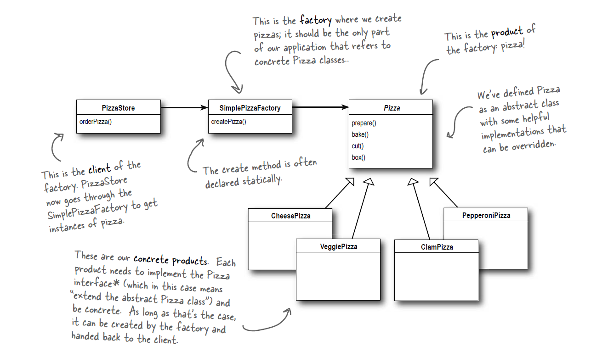
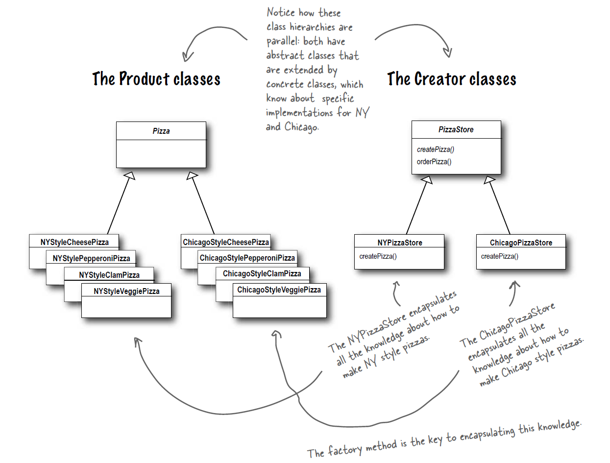
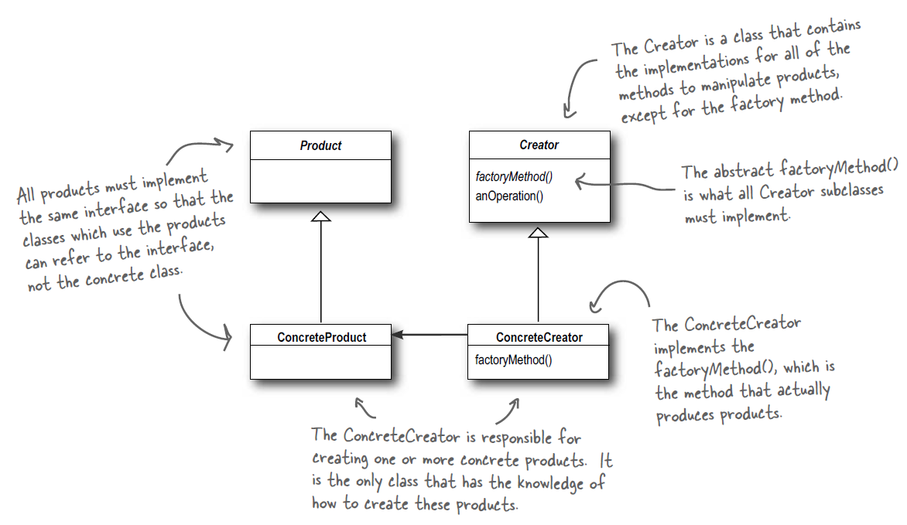
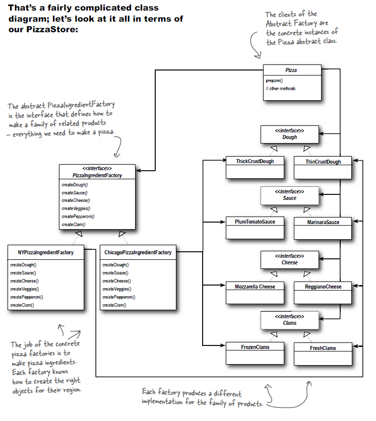
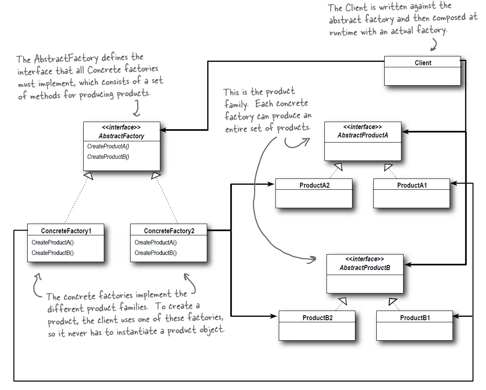

# The Factory Pattern

## Simple Factory

### The Simple Factory Defined

> The Simple Factory isn’t actually a Design Pattern; it's more of a programming idiom. But it is commonly used, so we'll give it a Head First Pattern Honorable Mention. Some developers do mistake this idiom for the "Factory Pattern," so the next time there is an awkward silence between you and another developer, you've got a nice topic to break the ice.

### UML for the Simple Factory

The simple factory in terms of the pizza example:

    

## Factory Method

## Factory Method Pattern defined

> **The Factory Method Pattern** defines an interface for creating an object, but lets subclasses decide which class to instantiate. Factory Method lets a class defer instantiation to subclasses.

### UML for the Factory Method

The factory method in terms of the pizza example:

    

The factory method in general:

    

### The Dependency Iversion Principle

> **Design Principle** Depend upon abstractions. Do not depend upon concrete classes.

### A few guidelines to help you follow the Principle...

> The following guidelines can help you avoid OO designs that violate the Dependency Inversion Principle:
>- No variable should hold a reference to a concrete class.
>- No class should derive from a concrete class.
>- No method should override an implemented method of
any of its base classes.

## Abstract Factory

### Abstract Factory Pattern defined

> **The Abstract Factory Pattern** provides an interface for creating families of related or dependent objects without specifying their concrete classes.

### UML for the Abstract Factory

The Abstract factory in terms of the pizza example:

    

The abstract factory in general:

    

