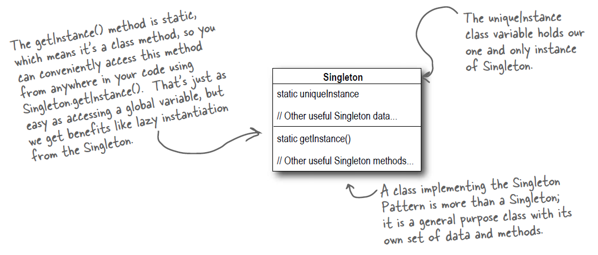

# The Singleton Pattern

## Singleton

### Dissecting the classic Singleton Pattern implementation

```go
type singleton struct {}

var instance *singleton

func newSingleton() *singleton {
    return &singleton{}
}

func GetInstance() *singleton {
    if instance == nil {
        instance = newSingleton()
    }
    return instance
}
```

### Singleton Pattern defined

> **The Singleton Pattern** ensures a class has only one instance, and provides a global point of access to it.

### Okay, let’s check out the class diagram:

<p align="center">
    
</p>

### Dealing with multithreading

Our multithreading woes are almost trivially fixed by making getInstance() a synchronized method.

### Can we improve multithreading?

1. Do nothing if the performance of getInstance() isn't critical to your application.
2. Move to an eagerly created instance rather than a lazily created one.
3. Use "double-checked locking" to reduce the use of synchronization in getInstance().

---

> Use [sync.Once](https://golang.org/pkg/sync/#Once) for real-case singletons when using Go.